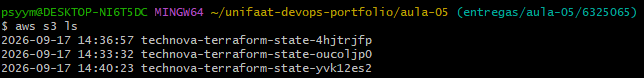
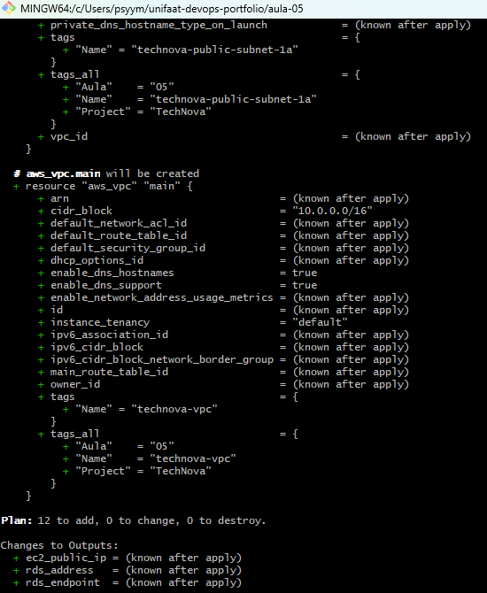

# Entrega — Aula 05: RDS, EC2 e Remote State

**Aluno:** Matheus Maciel de Paula  
**RA:** 6325065
**Data:** 2026-09-17  
**Repositório do Projeto:** https://github.com/mtmaciel1/unifaat-devops-portfolio

---

## 📋 Sobre a Atividade
Implementação da infraestrutura provisionada via Terraform utilizando Spec-Driven Development e boas práticas de DevOps, contendo:
- **Rede isolada:** VPC customizada com 1 Subnet Pública e 2 Subnets Privadas em AZs diferentes.
- **Banco de Dados:** RDS PostgreSQL (`db.t3.micro`) posicionado em subnets privadas, com armazenamento criptografado e acesso restrito exclusivamente ao Security Group da aplicação.
- **Aplicação:** Instância EC2 (`t2.micro`) na subnet pública configurada com o cliente PostgreSQL.
- **Backend Remoto:** Gerenciamento de estado seguro no Amazon S3 (`technova-terraform-state-yvk12es2`) com versionamento, encriptação e bloqueio de concorrência via DynamoDB (`technova-terraform-state-lock`).

---

## 🔍 Evidências da Implementação

### 1. Backend e Remote State no S3
O arquivo de estado do Terraform foi armazenado e validado com sucesso no bucket S3:
```text
2026-09-17 15:40:25         182 terraform.tfstate



